# SQL 1

## Database

### 데이터베이스
- 체계적인 데이터 모음

### 데이터
- 저장이나 처리에 효율적인 형태로 변환된 정보

### 증가하는 데이터 사용량
- 매일 초당 2억 개의 메일이 전송되며, 3만명이 넷플릭스를 시청
- 배달의 민족 월평균 주문 약 6천만건 (2020)
- 전세계 모든 데이터의 약 90%는 2015년 이후 생산된 것 (IBM)

- 데이터를 저장하고 잘 관리하여 활용할 수 있는 기술이 중요해짐


### 기존의 데이터 저장 방식
1. 파일 (File) 이용
2. 스프레드 시트(Spreadsheet) 이용

### 파일을 이용한 데이터 관리
- 어디에서나 쉽게 사용 가능
- 데이터를 구조적으로 관리하기 어려움
- 데이터를 나열할 뿐

### 스프레드 시트를 이용한 데이터 관리
- 테이블의 열과 행을 사용해 데이터를 구조적으로 관리 가능


### 스프레드 시트의 한계
- 크기
  - 일반적으로 약 100만 행까지만 저장가능

- 보안
  - 단순히 파일이나 링크 소유 여부에 따른 단순한 접근 권한 기능 제공

- 정확성
  - 만약 공식적으로 "강원"의 지명이 "강언"으로 바뀌었다고 가정한다면?
  - 이 변경으로 인해 테이블 모든 위치에서 해당 값을 업데이트 해야 함
  - 찾기 및 바꾸기 기능을 사용해 바꿀 수 있지만 만약 데이터가 여러 시트에 분산되어 있다면 변경에 누락이 생기거나 추가 문제가 발생할 수 있음


## Relational Database

### 데이터베이스 역할
- 데이터를 '저장' (구조적 저장)하고 '조작' (CRUD)

### 관계형 데이터베이스
- 데이터 간에 '관계'가 있는 데이터 항목들의 모음

- 테이블, 행, 열의 정보를 구조화하는 방식
- 서로 관련된 데이터 포인터를 저장하고 이에 대한 엑세스를 제공
- 예를 들어 고객 ID(pk) 번호를 저장하여 접근한다


### 관계
- 여러 테이블 간의 (논리적) 연결

### 관계형 데이터베이스
- 이 관계로 인해 두 테이블을 사용하여 데이터를 다양한 형식으로 조회할 수 있음
  - 특정 날짜에 구매한 모든 고객 조회
  - 지난 달에 배송일이 지연된 고객 조회 등


### 관계형 데이터베이스 예시
- 다음과 같이 고객 데이터가 테이블에 저장되어 있다고 가정
- 고객 데이터 간 비교를 위해서는 어떤 값을 활용해야 할까?
- -> 이름? 주소? 만약 동명이인이나 같은 주소지가 있다면?
- 각각의 데이터는 유니크하게 대변할 수 없다


- -> 각 데이터에 고유한 식별 값을 부여하기 (기본 키, Primary Key)

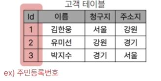

- -> 고객의 고유한 식별 값을 저장하자(외래 키, Foreign Key)


### 관계형 데이터 베이스 관련 키워드
1. Table (aka Relation)
2. Field (aka Column, Attribute)
   - 각 필드에는 고유한 데이터 형식(타입)이 지정됨
3. Record (aka Row, Tuple)
   
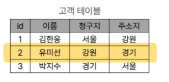

4. Database (aka Schema)
   - 테이블의 집합

5. Primary Key(기본 키)
   - 각 레코드의 고유한 값
   - 관계형 데이터베이스에서 '레코드의 식별자'로 활용


6. Foreign Key (외래 키)
   - 테이블의 필드 중 다른 테이블의 레코드를 식별할 수 있는 키
   - 다른 테이블의 기본 키를 참조
   - 각 레코드에서 서로 다른 테이블 간의 '관계를 만드는 데' 사용

## RDBMS

### DBMS (Database Management System)
- 데이터베이스를 관리하는 소프트웨어 프로그램

### RDBMS (Relational Database Management System)
- 관계형 데이터베이스를 관리하는 소프트웨어 프로그램

### DBMS
- 데이터 저장 및 관리를 용이하게 하는 시스템
- 데이터베이스와 사용자 간의 인터페이스 역할
- 사용자가 데이터 구성, 업데이트, 모니터링, 백업, 복구 등을 할 수 있도록 도움

### RDBMS 서비스 종류
- SQLite, MySQL, PostgreSQL, OracleDatabase ...

### SQLite
- 경량의 오픈 소스 데이터베이스 관리 시스템
- -> 컴퓨터나 모바일 기기에 내장되어 간단하고 효율적인 데이터 저장 및 관리를 제공

### 데이터베이스 정리
- Table은 데이터가 기록되는 곳
- Table에는 행에서 고유하게 식별 가능한 기본 키 라는 속성이 있으며, 외래 키를 사용하여 각 행에서 서로 다른 테이블 간의 관계를 만들 수 있음
- 데이터는 기본 키 또는 외래 키를 통해 결합(join)될 수 있는 여러 테이블에 걸쳐 구조화 됨

## SQL 

## 개요

### SQL 
- Structure Query Languagae
- 테이블의 형태로 '구조화'된 관계형 데이터베이스 에게 요청을 '질의(요청)'
- 데이터베이스에 정보를 저장하고 처리하기 위한 프로그래밍 언어
- ORM이 아닌 SQL을 통해서 데이터를 조작할 수 있다

### SQL 이란
- 관계형 데이터베이스와의 대화를 위해 사용하는 프로그래밍 언어


### SQL Syntax

```SQL
SELECT column_name FROM table_name;
```

- SQL 키워드는 대소문자를 구분하지 않음
  - 하지만 대문자로 작성하는 것을 권장(명시적 구분)

- 각 SQL Statements의 끝에는 세미콜론(;)이 필요
  - 세미콜론은 각 SQL Statements을 구분하는 방법 (명령어의 마침표)

### SQL Statements
- SQL을 구성하는 가장 기본적인 코드 블럭

### SQL Statemetns 예시

```SQL
SELECT column_name FROM table_name;
```

- 해당 예시 코드는 SELECT Statement라 부름
- 이 Statement는 SELECT, FROM 2개의 keyword로 구성됨

### 수행 목적에 따른 SQL Statements 4가지 유형
1. DDL - 데이터 정의
2. DQL - 데이터 검색
3. DML - 데이터 조작
4. DCL - 데이터 제어

### 수행 목적에 따른 SQL Statements 4가지 유형

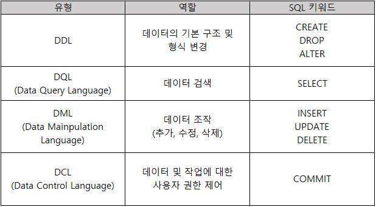

### SQL 학습
- 단순히 SQL 문법을 암기하고 상황에 따라 실행만 하는 것이 아닌 SQL을 통해 관계형 데이터베이스를 잘 이해하고 다루는 방법을 학습

## 참고

### Query
- "데이터베이스로부터 정보를 요청" 하는 것
- 일반적으로 SQL로 작성하는 코드를 쿼리문(SQL문)이라고 함

### SQL 표준
- SQL은 미국 국립 표준 협회(ANSI)와 국제 표준화 기구(ISO)에 의해 표준이 채택됨
- 모든 RDBMS에서 SQL 표준을 지원
- 다만 각 RDBMS마다 독자적인 기능에 따라 표준을 벗어나는 문법이 존재하니 주의

## Querying data

## SELECT

### SELECT statement
- 테이블에서 데이터를 조회

### SELECT syntax

```SQL
SELECT
  select_list
FROM
  table_name;
```

- SELECT 키워드 이후 데이터를 선택하려는 필드를 하나 이상 지정
- FROM 키워드 이후 데이터를 선택하려는 테이블의 이름을 지정

### SELECT 활용
- 테이블 employees에서 LastName 필드의 모든 데이터를 조회
  
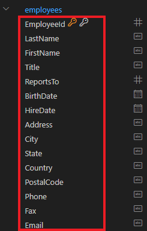

```SQL
SELECT
  LastName
FROM
  employees;
```


- 테이블 employees에서 LastName, FirstName 필드의 모든 데이터를 조회

```SQL
SELECT
  LastName, FirstName
FROM
  employees;
```


- 테이블 employees에서 모든 필드 데이터를 조회

```SQL
SELECT
  *
FROM
  employees;
```


- 테이블 employees에서 FirstName 필드의 모든 데이터를 조회
- (단, 조회 시 FirstName이 아닌 '이름'으로 출력 될 수 있도록 변경)

```SQL
SELECT
  FirstName As '이름'
FROM
  employees;
```


- 테이블 tracks에서 Name, Milliseconds 필드의 모든 데이터 조회
- (단, Milliseconds 필드는 60000으로 나눠 분 단위 값으로 출력)

```SQL
SELECT
  Name, Milliseconds / 60000
FROM
  tracks;
```


### SELECT 정리
- SELECT 문을 사용하여 테이블의 데이터를 조회 및 반환
- '*' (asterisk)를 사용하여 모든 필드 선택
  
## Sorting data

## ORDER BY

### ORDER BY statement
- 조회 결과의 레코드를 정렬

### ORDER BY syntax
- FROM clause 뒤에 위치
- 하나 이상의 컬럼을 기준으로 결과를 오름차순(ASC, 기본 값), 내림차순(DESC)으로 정렬

### ORDER BY 활용
- 테이블 employees에서 FirstName 필드의 모든 데이터를 오름차순으로 조회

```SQL
SELECT
  FirstName
FROM
  employees
ORDER BY
  FisrtName ASC;
```


- 테이블 employees에서 FirstName 필드의 모든 데이터를 내림차순으로 조회

```SQL
SELECT
  FirstName
FROM
  employees
ORDER BY
  FisrtName DESC;
```


- 테이블 customers에서 Country 필드를 기준으로 내림차순으로 정렬 한 다음 City 필드 기준으로 오름차순 정렬하여 조회

```SQL
SELECT
  Country, City
FROM
  customers
ORDER BY
  Country DESC,
  City ASC;
```
- 같은 나라끼리 내림차순 정렬 후 도시를 오름차순으로 정렬


- 테이블 tracks에서 Milliseconds 필드를 기준으로 내림차순으로 정렬한 다음 Name, Milliseconds 필드의 모든 데이터를 조회
- (단, Milliseconds 필드는 60000으로 나눠 분 단위 값으로 출력)


### 정렬애서의 NULL
- NULL 값이 존재할 경우 오름차순 정렬 시 결과에 NULL이 먼저 출력

```SQL
SELECT
  ReportsTo
FROM
  employees
ORDER BY
  ReportsTo;
```

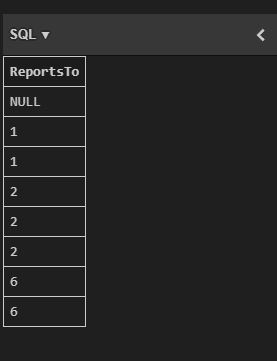

### SELECT statement 실행 순서
- FROM -> SELECT -> ORDER BY
1. 테이블에서(FROM)
2. 조회하여 (SELECT)
3. 정렬 (ORDER BY)

## Filtering data

### Filtering data 관련 Keywords
- Clause (DISTINCT, WHERE, LIMIT)
- Operatro (BETWEEN, IN, LIKE, Comparison, Logical)

## DISTINCT

### DISTINCT statement
- 조회 결과에서 중복된 레코드를 제거

### DISTINCT 활용
- 테이블 customers에서 Country 필드의 모든 데이터를 오름차순 조회

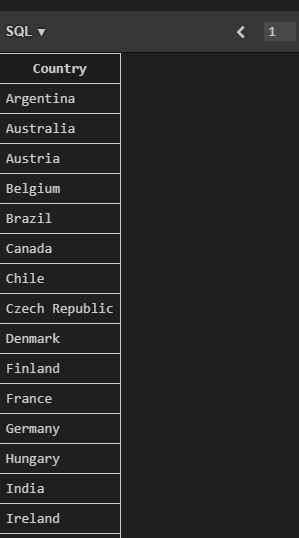

## WHERE

### WHERE statement
- 조회 시 특정 검색 조건을 지정

### WHERE syntax

```SQL
SELECT
  select_list
FROM
  table_name
WHERE
  search_condition;
```
- FROM clause 뒤에 위치
- search_condition은 비교 연산자 및 논리연산자 (AND, OR, NOT, IN)를 사용하는 구문이 사용됨

### WHERE 활용
- 테이블 customers에서 City 필드 값이 'Prague'인 데이터의 LastName, FirstName, City 조회

```SQL
SELECT
  LastName, FirstName, City
FROM
  customers
WHERE
  City = 'Prague';
```

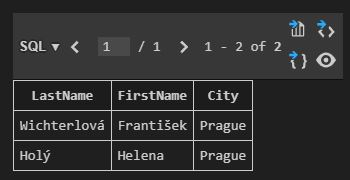

- 테이블 customers에서 City 필드 값이 'Prague'가 아닌 데이터의 LastName, FirstName, City 조회

```SQL
SELECT
  LastName, FirstName, City
FROM
  customers
WHERE
  City != 'Prague'
```

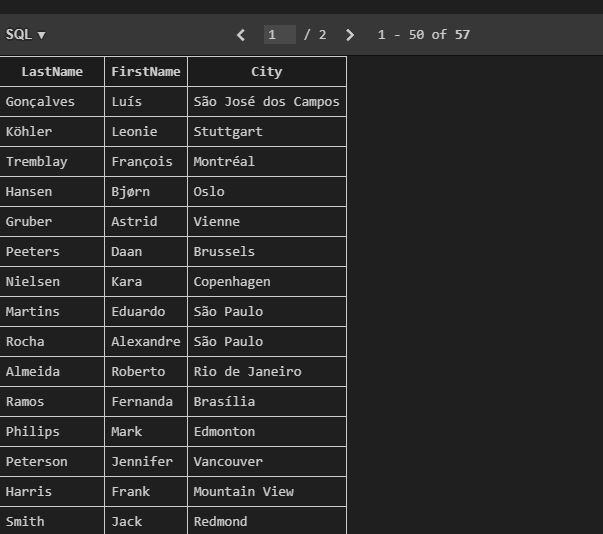

- 테이블 customers에서 Company 필드 값이 NULL이고 Country 필드 값이 'USA'인 데이터의 LastName, FirstName, Company, Country 조회

```SQL
SELECT
  LastName, FirstName, Company, Country
FROM
  customers
WHERE
  Company IS NULL
  AND Country = 'USA';
```

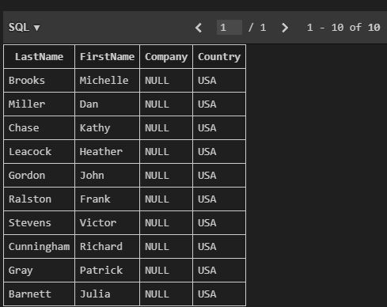

- 테이블 customers에서 Company 필드 값이 NULL이거나 Country 필드 값이 'USA'인 데이터의 LastName, FirstName, Company, Country 조회

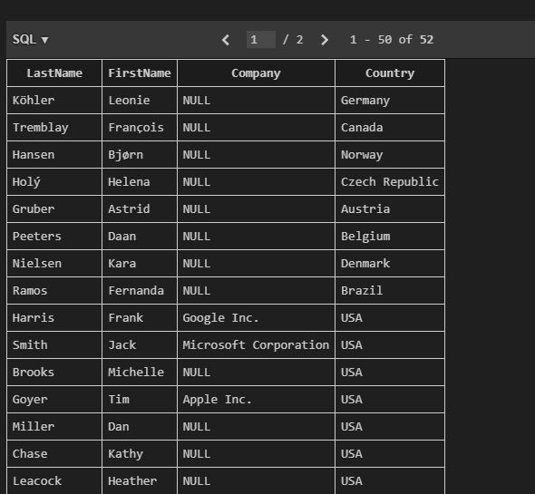

- 테이블 tracks에서 Bytes 필드 값이 100000 이상 500000 이하인 데이터의 Name, Bytes 조회

```SQL
SELECT 
  Name, Bytes
FROM
  tracks
WHERE
  Bytes BETWEEN 100000 AND 500000;
```

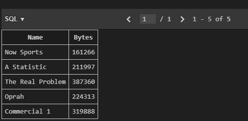

- 테이블 tracks에서 Bytes 필드 값이 100000 이상 500000 이하인 데이터의 Name, Bytes 을 Bytes를 기준으로 오름차순 조회

```SQL
SELECT 
  Name, Bytes
FROM
  tracks
WHERE
  Bytes BETWEEN 100000 AND 500000
ORDER BY
  Bytes;
```

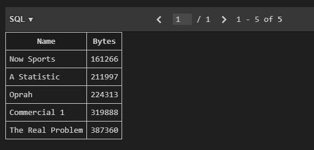

- 테이블 customers에서 Country 필드 값이 'Canada' 또는 'Germany' 또는 'France'인 데이터의 LastName, FirstName, Country 조회

```SQL
SELECT
  LastName, FirstName, Country
FROM
  customers
WHERE
  Country IN ('Canada', 'Germany', 'France');
```


- 테이블 customers에서 Country 필드 값이 'Canada' 또는 'Germany' 또는 'France'가 아닌 데이터의 LastName, FirstName, Country 조회

```SQL
SELECT
  LastName, FirstName, Country
FROM
  customers
WHERE
  Country NOT IN ('Canada', 'Germany', 'France');
```

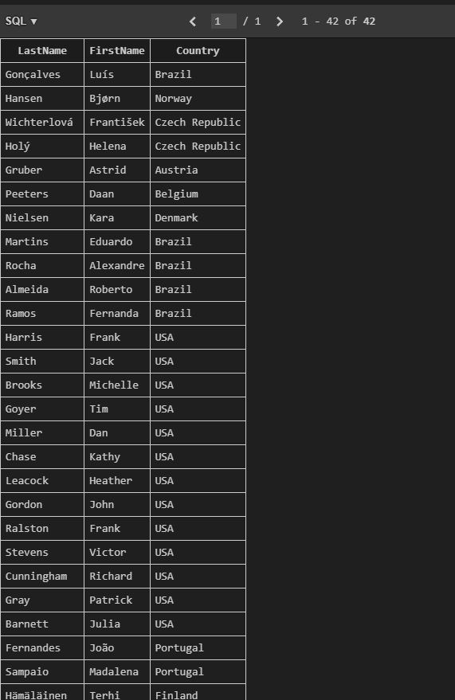

- 테이블 customers에서 LastName 필드 값이 son으로 끝나는 데이터의 LastName, FirstName 조회

```SQL
SELECT
  LastName, FirstName
FROM
  customers
WHERE
  LastName LIKE '%son';
```

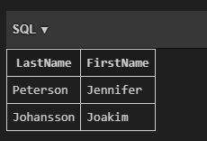

- 테이블 customers에서 FirstName 필드 값이 4자리면서 'a'로 끝나는 데이터의 LastName, FirstName 조회

```SQL
SELECT
  LastName, FirstName
FROM
  customers
WHERE
  FirstName LIKE '___a';
```

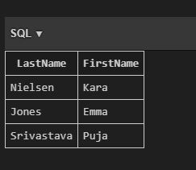

## Operatios

### Comparision Operators
- 비교 연산자
- =, >=, <=, !=, IS(Null), LIKE, IN, BETWEEN...AND

### Logical Operators
- 논리 연산자
- AND(&&), OR(||), NOT(!)

### IN Operator
- 값이 특정 목록 안에 있는지 확인

### LIKE Operator
- 값이 특정 패턴에 일치하는지 확인
- (Wildcards와 함께 사용)

### Wildcard Characters
- '%' : 0개 이상의 문자열과 일치하는지 확인
- '_' : 단일 문자와 일치하는지 확인

### LIMIT clause
- 조회하는 레코드 수를 제한

### LIMIT syntax

```SQL
SELECT
  select_list
FROM
  table_name
LIMIT [offset,] row_count;
```

- 하나 또는 두 개의 인자를 사용 (0 또는 양의 정수)
- row_count는 조회하는 최대 레코드 수를 지정

### LIMIT & OFFSET 예시

```SQL
SELECT
  ..
FROM
  ..
LIMIT 2, 5;
```

### LIMIT 활용

- 테이블 tracks에서 TrackId, Name, Bytes 필드 데이터를 Bytes 기준 내림차순으로 7개만 조회

```SQL
SELECT
  TrackId, Name, Bytes
FROM
  tracks
ORDER BY
  Bytes DESC
LIMIT 7;
```

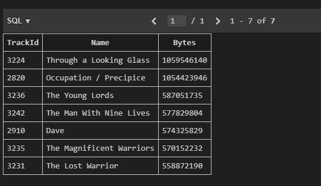

- 테이블 tracks에서 TrackId, Name, Bytes 필드 데이터를 Bytes 기준 내림차순으로 4번째부터 7번째 데이터만 조회

```SQL
SELECT
  TrackId, Name, Bytes
FROM
  tracks
ORDER BY
  Bytes DESC
-- LIMIT 3, 4;
LIMIT 4 OFFSET 3;
```

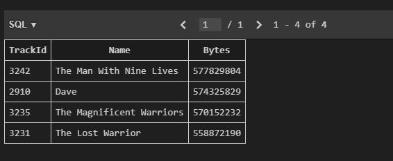

## GROUP BY

### GROUP BY clause
- 레코드를 그룹화하여 요약본 생성
- ('집계 함수'와 함께 사용)

### Aggregation Functions
- 집계 함수
- 값에 대한 계산을 수행하고 단일한 값을 반환하는 함수
- SUM, AVG, MAX, MIN, COUNT

### GROUP BY syntax

```SQL
SELECT
  c1, c2,..., cn, aggregate_function(ci)
FROM
  table_name
GROUP BY
  c1, c2, ... ,cn;
```

- FROM 및 WHERE 절 뒤에 배치
- GROUP BY 절 뒤에 그룹화 할 필드 목록을 작성

### GROUP BY 예시

- Countrty 필드 그룹화
  
```SQL
SELECT
  Country
FROM
  customers
GROUP BY
  Country;
```

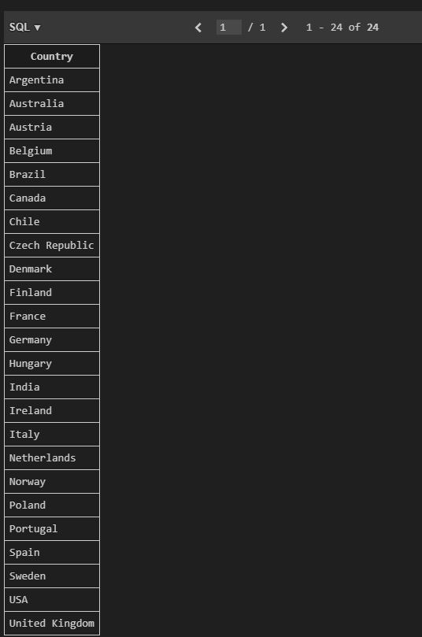

- COUNT 함수가 각 그룹에 대한 집계된 값을 계산

```SQL
SELECT
  Country, COUNT(*)
FROM
  customers
GROUP BY
  Country;
```

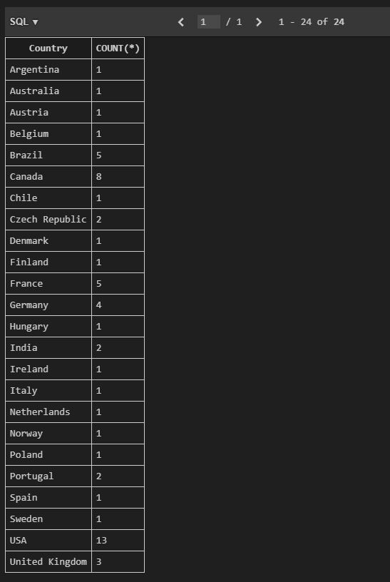

### GROUP BY 활용
- 테이블 tracks에서 Composer 필드를 그룹화 하여 그룹에 대한 Bytes의 평균 값을 내림차순 조회

```SQL
SELECT
  Composer, AVG(Bytes)
FROM
  tracks
GROUP BY
  Composer
ORDER BY
  AVG(Bytes) DESC;
```

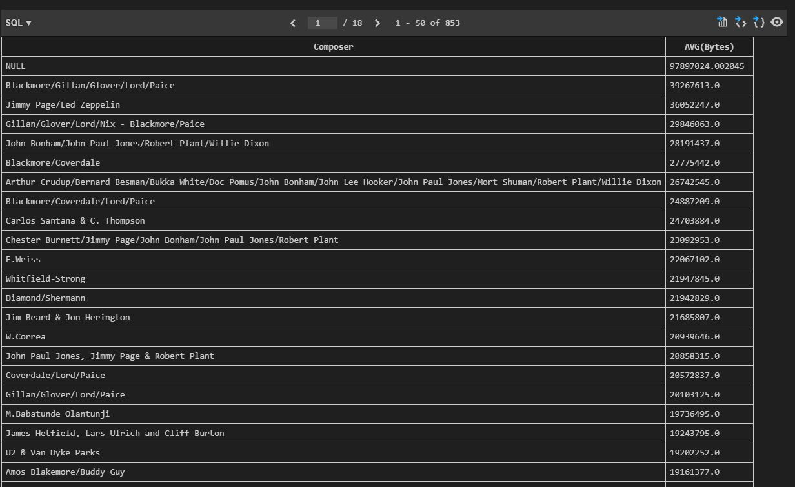

- 테이블 tracks에서 Composer 필드를 그룹화 하여 그룹에 대한 Milliseconds의 평균 값이 10 미만인 데이터 조회
- (단, Milliseconds 필드는 60000으로 나눠 분 단위 값의 평균으로 계산)

```SQL
SELECT
  Composer,
  AVG(Milliseconds / 60000) AS avgOfMinute
FROM
  tracks
GROUP BY
  Composer;
```

- 에러 발생

- HAVING clasue
  - 집계 항목에 대한 세부 조건을 지정
  - 주로 GROUP BY와 함께 사용되며 GROUP BY가 없다면 WHERE처럼 동작

```SQL
SELECT
  Composer,
  AVG(Milliseconds / 60000) AS avgOfMinute
FROM
  tracks
GROUP BY
  Composer
HAVING
  avgOfMinute < 10;
```

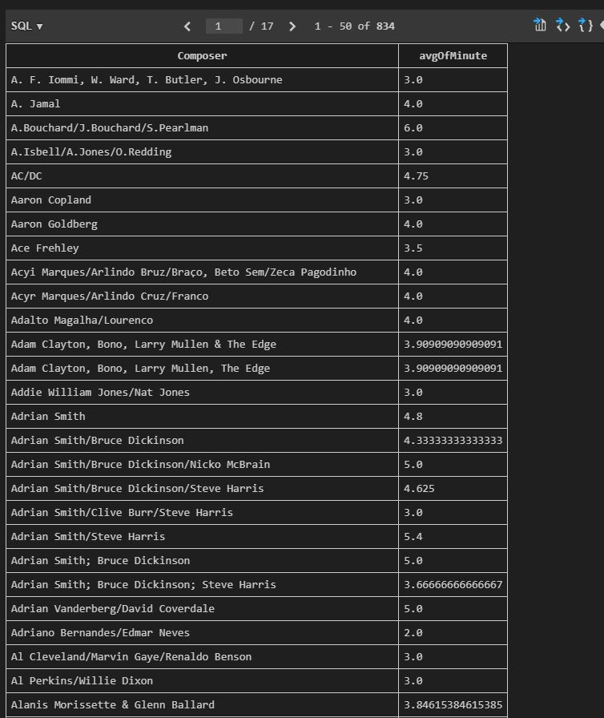

### SELECT statement 실행 순서
- FROM -> WHERE -> GROUP BY -> HAVING -> SELECT -> ORDER BY -> LIMIT
1. 테이블에서 (FROM)
2. 특정 조건에 맞추어 (WHERE)
3. 그룹화 하고 (GROUP BY)
4. 만약 그룹 중에서 조건이 있다면 맞추고 (HAVING)
5. 조회하여 (SELECT)
6. 정렬하고 (ORDER BY)
7. 특정 위치의 값을 가져옴 (LIMIT)