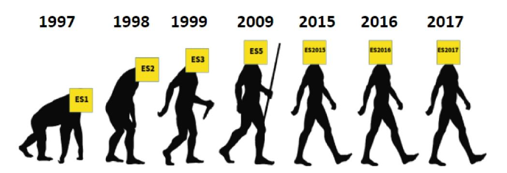
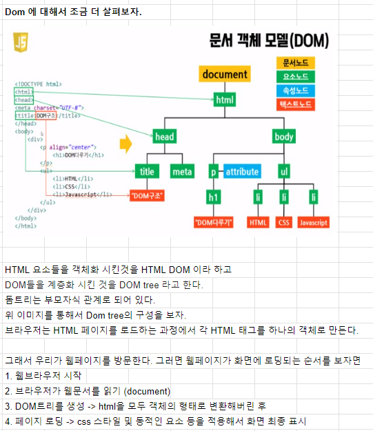

# Introduction of JavaScript

## History of JavaScript

## 웹 브라우저와 JavaScript

### 웹의 탄샌(1990)
- 팀 버너스리 경이 WWW, 하이퍼텍스트 시스템 고안
- URL, HTTP 최초 설계 및 구현
- 초기의 웹은 정적인 텍스트 페이지만을 지원
- https://info.cern.ch/ (최초의 웹사이드)

### 웹 브라우저의 대중화 (1993)
- Netscape사의 최초 상용 웹 브라우저인 Netscape Navigator 출시
- 당시 약 90% 이상의 시장 점유율을 가짐

### JavaScript의 탄생 (1995)
- 당시 Netscape 소속 개발자 Brandon Eich는 웹의 동적 기능 개발이라는 회사의 요구사항을 넘어 스크립트 언어 Mocha를 개발
- 이후 LiveScript로 이름을 변경했으나 당시 가장 인기있던 프로그래밍 언어인 Java의 명성에 기대보고자 JavaScript로 이름을 변경
- JavaScript는 Netscape Navigator 2.0에 탑재되어 웹 페이지에 '동적 기능'을 추가하는 데 사용됨

### JavaScript 파편화 (1996)
- Microsoft가 자체 웹 브라우저인 인터넷 익스플로러 3.0에 JavaScript와 유사한 언어인 JScript를 도입
- 이 과정에서 많은 회사들이 자체적으로 JavaScript를 독자적으로 변경하고 이를 자체 브라우저에 탑재
- -> JavaScript 파편화의 시작

### 1차 브라우저 전쟁 (1995-2001)

- Microsoft IE를 자사 윈도우 운영체제에 내장하여 무료로 배포
- 빌 게이츠를 필두로 한 Microsoft의 공격적인 마케팅, 자금력 그리고 윈도우 운영체제 점유율 앞에 Netscape는 빠르게 몰락하기 시작
- IE의 시장 점유율은 2002년 96%에 달하며 Microsoft가 승리
- 추후 Brandon Eich와 함께 Netscape에서 나온 핵심 개발진은 모질라 재단을 설립하여 Firefox 브라우저를 출시 (2003)

### 1차 브라우저 전쟁의 영향

- 웹 표준의 부재로 인해 각 기업에서 자체 표준을 확립하려는 상황이 벌어짐
- 이는 웹 개발자들에게 큰 혼란을 주었으며, 결국 웹 표준의 중요성을 인식하는 계기가 됨

### ECMAScript 출시 (1997)
- JavaScript의 파편화를 막기 위해 1997년 ECMA에서 ECMAScript라는 표준 언어를 정의
- 이때부터 JavaScript는 ECMAAScript 표준에 기반을 두고 발전하기 시작

### 2차 브라우저 전쟁 (2004-2017)

- IE에 독주에 대한 Firefox의 대항
  - 2008년까지 30% 점유율 차지
- Google의 Chrome 브라우저 출시(2008)
- Chrome은 출시 3년 만에 Firefox의 점유율을 넘어서고 그로부터 바년 뒤 IE의 점유율을 넘어섬

### 2차 브라우저 전쟁의 영향
- 웹 표준을 준수하는 Chrome의 등장으로 웹 표준의 중요성이 대두
- 웹의 기능이 크게 확장되며 웹 애플리케이션의 비약적인 발전을 이끌어감

- -> 웹의 기술적 발전과 웹 표준의 중요성

## ECMAScript
- Ecma International (정보와 통신 시스템을 위한 국제적 표준화 기구)이 정의하고 있는 표준화된 스크립트 프로그래밍 언어 명세

- -> 스크립트 언어가 준수해야하는 규칙, 세부사항 등을 제공

### ECMAScript와 JavaScript
- JavaScript는 ECMAScript 표준을 구현한 구체적인 프로그래밍 언어
- ECMAScript의 명세를 기반으로 하여 웹 브라우저나 Node.js와 같은 환경에서 실행됨

- -> ECMAScript는 JavaScript의 표준이며, JavaScript는 ECMAScript 표준을 따르는 구체적인 프로그래밍 언어
- -> ECMAScript는 언어의 핵심을 정의하고, JavaScript는 ECMAScript 표준을 따라 구현된 언어로 사용됨

### ECMAScript의 역사
- ECMAScript 5 (ES5)에서 안정성과 생산성을 크게 높임(2009)
- ECMAScript 2015(ES6)에서 객체지향 프로그래밍 언어로써 많은 발전을 이루어, 역사상 가장 중요한 버전으로 평가됨 (2015)

### JavaScript의 현재
- 현재는 Chrome, Firefox, Safari, Microsoft Edge 등 다양한 웹 브라우저가 출시되어 있으며, 웹 브라우저 시장이 다양화 되어있음
- 기존에 JavaScript는 브라우저에서만 웹 페이지의 동적인 기능을 구현하는 데에만 사용되었음
  - 예를 들어, 사용자의 입력에 따라 웹 페이즈이 내용이 동적으로 변경되거나, 애니메이션 효과가 적용되는 등의 기능
- 이후 브라우저에서 벗어나 Node.js와 같은 서버 사이드 분야 뿐만 아니라, 다양한 프레임워크와 라이브러리들이 개발되면서, 웹 개발 분야에서는 필수적인 언어로 자리 잡게 됨

## JavaScript and DOM

## DOM

## DOM 개요

### 웹 브라우저에서의 JavaScript
- 웹 페이지의 동적인 기능을 구현

### Java Script 실행 환경 종류
1. HTML script 태그

- 콘솔 탭에 출력 됨

2. js 확장자 파일

3. 브라우저 Console

- 개발자 도구 콘솔에서 직접 입력

### DOM (The Document Object Model)
- 웹 페이지 (Document)를 구조화된 "객체로 제공"하여 프로그래밍 언어가 페이지 구조에 접근할 수 있는 방법을 제공
- -> 문서 구조, 스타일, 내용 등을 변경할 수 있도록 함

### DOM 특징
- DOM에서 모든 요소, 속성, 텍스트는 하나의 객체
- 모두 document 객체의 자식으로 구성됨

### DOM tree
- 브라우저는 HTML 문서를 해석하여 DOM tree 라는 객체 트리로 구조화
- -> 객체 간 상속 구조가 존재

### 브라우저가 웹 페이지를 불러오는 과정
- 웹 페이지는 웹 브라우저를 통해 해석되어 웹 브라우저 화면에 나타남

### DOM 핵심
- 문서의 요소들을 객체로 제공하여 다른 프로그래밍 언어에서 접근하고 조작할 수 있는 방법을 제공하는 API

## document 객체

- 웹 페이지 객체
- DOM Tree의 진입점
- 페이지를 구성하는 모든 객체 요소를 포함

## DOM 선택

### DOM 조작 시 기억 해야 할 것
- 웹 페이지를 동적으로 만들기 == 웹 페이지를 조작하기
  - 조작 순서
    1. 조작하고자 하는 요소를 선택 (또는 탐색)
    2. 선택된 요소의 콘텐츠 또는 속성을 '조작'

## 선택 메서드

### 선택 메서드
- 카멜 케이스
  
- document.querySelector()
  - 요소 한 개 선택

- document.querySelectorAll()
  - 요소 여러 개 선택

### document.querySelector(selector)
- 제공한 선택자와 일치하는 element 한 개 선택
- -> 제공한 CSS selector를 만족하는 "첫 번째" element 객체를 반환 (없다면 null 반환)

### document.querySelectorAl(selector)
- 제공한 선택자와 일치하는 여러 element를 선택
- -> 제공한 CSS selector를 만족하는 NodeList를 반환
- 하나하나의 요소를 Node 라고 함

### DOM 선택 실습

- Selector 시 첫번째 (content1) 을 출력
- SelectorAll 시 리스트 형태로 index, length 존재
- 태그로도 접근 가능 (자식 태그도 접근 가능)
- Selector 시 특정 데이터에 접근하고 싶을 때 개발자 도구에서 Copy -> Copy selector를 하여 주소를 받아와서 출력을 할 수 있다

## DOM 조작

## 속성 조작

### 속성(attribute) 조작
1. 클래스 속성 조작
2. 일반 속성 조작

### 클래스 속성 조작
- 'classList' property
- 요소의 클래스 목록을 DOMTokenList(유사 배열) 형태로 반환

### classList 메서드
- element.classList.add()
  - 지정한 클래스 값을 추가
  
- element.classList.remove()
  - 지정한 클래스 값을 제거

- element.classList.toggle()
  - 클래스가 존재한다면 제거하고 false를 반환
  - 존재하지 않으면 클래스를 추가하고 true 반환
  
- https://developer.mozilla.org/ko/docs/Web/API/Element/classList

### 클래스 속성 조작 실습

#### add()와 remove() 메서드를 사용해 지정한 클래스 값을 추가 혹은 제거

- h1Tag의 classList를 출력했을 때 DOMTokenList(유사 배열)의 형태

### 속성 조작 메서드
- Element.getAttribute()
  - 해당 요소에 지정된 값을 반환(조회)

- Element.setAttribute(name, value)
  - 지정된 요소의 속성 값을 설정
  - 속성이 이미 있으면 기존 값을 갱신 (그렇지 않으면 지정된 이름과 값으로 새 속성이 추가)

- Element.removeAttribute()
  - 요소에서 지정된 이름을 가진 속성 제거

### 속성 조작 실습

## HTML 콘텐츠 조작

### HTML 콘텐츠 조작
- 'textContent' property
  - 요소의 텍스트 콘텐츠를 표현

- 
 lorem 

### HTML 콘텐츠 조작 실습

## DOM 요소 조작

### DOM 요소 조작 메서드
- document.createElement(tagName)
  - 작성한 tagName의 HTML 요소를 생성하여 반환

- Node.appendChild()
  - 한 Node를 특정 부모 Node의 자식 NodeList 중 마지막 자식으로 삽입
  - 추가된 Node 객체를 반환

- Node.remvoeChild()
  - DOM에서 자식 Node를 제거
  - 제거된 Node를 반환

### DOM 요소 조작 실습

- 순서는 관점에 차이에 따라 다르다
- 작성한 tagName은 반환하기 때문에 변수에 할당할 수 있다
- 자바 스크립트의 병렬적 구동 순서(비동기적)에 의해서 textContent에 할당을 나중에 해도 textContent가 출력이 된다

## style 조작

- 'style' property
  - 해당 요소의 모든 style 속성 목록을 포함하는 속성

### style 조작 실습

- style 태그 작성하지 않고 실습
- style type은 객체 (key, value 값을 같는다) 형태
- css와 다르게 하이픈을 쓰지 않고 대소문자 구분을 잘해야한다. (font-size vs fontSize)
- 태그 내 인라인 스타일로 입력되게 된다

## 참고

### Node
- DOM의 기본 구성 단위
- DOM 트리의 각 부분은 Node라는 객체로 표현됨
  - Document Node => HTML 문서 전체를 나타내는 노드
  - Element Node => HTML 요소를 나타내는 노드 ex) 

  - Text Node => HTML 텍스트, Element Node 내의 텍스트 컨텐츠를 나타냄
  - Attribute Node => HTML 요소의 속성을 나타내는 노드

### NodeList
- DOM 메서드를 사용해 선택한 Node의 목록
- 배열과 유사한 구조를 가짐
- Index로만 각 항목에 접근 간으
- 다양한 배열 메서드 사용 가능
- querySelectorAll()에 의해 반환되는 NodeList는 DOM의 변경사항을 실시간으로 반영하지 않음

### Element
- Node의 하위 유형
- Element는 DOM 트리에서 HTML 요소를 나타내는 특별한 유형의 Node
- 예를 들어, 
, 
, , <body> 등의 HTML 태그들이 Element 노드를 생성
- Node의 속성과 메서드를 모두 가지고 있으며 추가적으로 요소 특화된 기능(예 : className, innerHTML, id 등)을 가지고 있음
- -> 모든 Element는 Node 이지만, 모든 Node가 Element인 것은 아님
