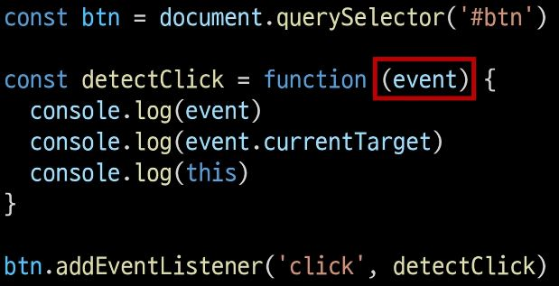

# Controlling event

## 이벤트

## 개요

### 일성속의 이벤트
- 컴퓨터 키보드를 눌러 텍스트를 입력하는 것
- 전화벨이 울려 전화가 왔음을 알리는 것
- 손을 흔들어 인사하는 것
- 전화기의 버튼을 눌러서 통화를 시작하는 것
- 리모컨을 사용하여 채널을 변경하는 것

### 웹에서의 이벤트
- 버튼을 클릭했을 때 팝업 창이 출력되는 것
- 마우스 커서의 위치에 따라 드래그 앤 드롭하는 것
- 사용자의 키보드 입력 값에 따라 새로운 요소를 생성하는 것

- -> 일상에서의 이벤트처럼 웹에서도 "이벤트를 통해 특정 동작을 수행"한다.

## event
- 무언가 일어났다는 신호, 사건
- -> 모든 DOM 요소는 이러한 event를 만들어 냄

### event object
- DOM에서 이벤트가 발생했을 때 생성되는 객체

- 이벤트 종류
  - mouse, input, keyboard, touch ...
  - https://developer.mozilla.org/en-US/docs/Web/API/Event

### DOM 요소는 event를 받고 받은 event를 '처리' (event handler (이벤트 처리기)) 할 수 있음

## event handler

### event handler
- 이벤트가 발생했을 때 실행되는 함수
- -> 사용자의 행동에 어떻게 반응할지를 JavaScript 코드로 표현한 것

### .addEventListener()
- 대표적인 이벤트 핸들러 중 하나
- -> 특정 이벤트를 DOM 요소가 수신할 때마다 콜백 함수를 호출

### .addEventListener(type, handler)

- type
  - 수신할 이벤트 이름
  - 문자열로 작성 (ex. 'click')

- handler
  - 발생한 이벤트 객체를 수신하는 콜백 함수
  - 콜백 함수는 발생한 Event object를 "유일한 매개변수"로 받음

### .addEventListener 활용

- "버튼을 클릭하면 요소 출력하기"
- -> 버튼을 선택하고 버튼에 이벤트 처리기를 부착하여 클릭 이벤트가 발생하면 이벤트가 발생한 버튼정보를 출력

- 요소에 addEventListener를 부착하게 되면 내부의 this 값은 대상 요소(강제로 앞의 DOM 요소)를 가리키게 됨 (event 객체의 currentTarget 속성 값과 동일)

- arrow function으로 표현하면 this는 window를 출력

- 콜백함수가 길어질 경우 따로 작성 가능

### addEventListener의 콜백 함수 특징
- 발생한 이벤트를 나타내는 Event 객체를 유일한 매개변수로 받음
- 아무것도 반환하지 않음

## 버블링

### 버블링 (Bubbling)
- 한 요소에 이벤트가 발생하면, 이 요소에 할당된 핸들러가 동작하고, 이어서 부모 요소의 핸들러가 동작하는 현상
- 가장 최상단의 조상 요소 (document)를 만날 때까지 이 과정이 반복되면서 요소 각각에 할당된 핸들러가 동작
- -> 이벤트가 제일 깊은 곳에 있는 요소에서 시작해 부모 요소를 거슬러 올라가며 발생하는 것이 마치 물속 거품과 닮았기 때문

### 버블링 예시

- 가장 안쪽의 
 요소를 클릭하면 p -> div -> form 순서로 3개의 이벤트 핸들러가 동작

- 버블의 방향이 상위 요소로 향하고 있음

### 이벤트가 정확히 어디서 발생했는지 접근할 수 있는 방법
- evet.target
- event.currentTarget

### 'target' & 'currentTarget' 속성
- 'target' 속성
  - 이벤트가 발생한 가장 안쪽의 요소 (target)를 참조하는 속성
  - 실제 이벤트가 시작된 (발생한) target 요소
  - 버블링이 진행 되어도 변하지 않음

- 'currentTarget' 속성
  - '현재' 요소
  - 항상 이벤트 핸들러가 연결된 요소만을 참조하는 속성
  - 'this'와 같음

### 'target' & 'currentTarget' 예시
- 세 요소 중 가장 최상위 요소인 outerouter 요소에만 이벤트 핸들러가 부착
- 각 요소를 클릭 했을 때 event의 target과 currentTarget의 차이 비교

- 'target'
  - 실제 이벤트가 발생하는 요소를 가리킴

- 'currentTarget'
  - 핸들러가 연결된 outerouter 요소만을 가리킴

- 핸들러는 outerouter에 하나 밖에 없지만 이 핸들러에서 outerouter의 내부 모든 하위 요소에 발생하는 클릭 이벤트를 잡아내고 있음
- 클릭 이벤트가 어디서 발생했든 상관없이 outerouter까지 이벤트가 버블링 되어 핸들러를 실행시키기 때문

- 실제 target 까지 찾아 내려가는 capturing 과정이 먼저 일어난다 (브라우저가 하기 때문에 개발자가 사용하지 않는다)
- target 부터 eventhandler가 부착된 곳 까지 찾아서 bubbling 하며 올라간다

- ul 태그 (부모 요소)에 eventhandler를 부착하여 target인 li(자식 요소)에서 event를 버블링 현상에 의해 발생시킬 수 있다

## event handler 활용

### event handler 활용 실습
1. 버튼을 클릭하면 숫자를 1씩 증가해서 출력하기
2. 사용자의 입력 값을 실시간으로 출력하기
3. 사용자의 입력값을 실시간으로 출력
   - '+' 버튼을 클릭하면 출력한 값의 CSS 스타일을 변경하기
4. todo 프로그램 구현
5. 로또 번호 생성기 구현

- '~하면' (event) ~하기 (동작)

### 1. click 이벤트 실습
- 버튼을 클릭하면 숫자를 1씩 증가

### 2. input 이벤트 실습
- 사용자의 입력 값을 실시간으로 출력하기
- event.currentTarget.value 를 통해 사용자 입력값을 출력

### currentTarget 주의사항
- console.log()로 event 객체를 출력할 경우 currentTarget 키의 값은 null을 가짐
- currentTarget은 이벤트가 처리되는 동안에만 사용할 수 있기 때문
- 대신 console.log(event.currentTarget)을 사용하여 콘솔에서 확인 가능
- -> currentTarget 이후의 속성 값들은 'target'을 참고해서 사용하기

### 3. click & input 이벤트 실습
- 사용자의 입력 값을 실시간으로 출력
  - + 버튼을 클릭하면 출력한 값의 CSS 스타일을 변경하기

### 4. todo 실습

- todo 기능 추가
  1. 빈 문자열 입력 방지
  2. 입력이 없을 경우 경고 대화상자를 띄움

### 5. 로또 번호 생성기 실습

- 기능을 도와주는 Lodash 라이브러리를 불러와서 진행

- 배열을 만드는 range 메서드 사용

- sampleSize 메서드 사용, 랜덤 6개 숫자 배열 뽑기

### lodash
- 모듈성, 성능 및 추가 기능을 제공하는 JavaScript 유틸리티 라이브러리 
- _.method 형태로 메서드를 불러온다
- array, object 등 자료구조를 다룰 때 사용하는 유용하고 간편한 함수들을 제공
- https://lodash.com/

## 이벤트 기본 동작 취소

### .preventDefault()
- 해당 이벤트에 대한 기본 동작을 실행하지 않도록 지정
- 기본적으로 a 태그에 해당
- 전파를 취소하는 것이 아닌 기본동작만을 실행하지 않게 하는 것

### 이벤트 동작 취소 실습
- copy 이벤트 동작 취소

- form 제출 시 새로고침 동작 취소

## 참고

### addEventListener에서의 화살표 함수 주의 사항
- 화살표 함수는 자신만의 this를 가지지 않기 때문에 자신을 포함하고 있는 함수의 this를 상속 받음

