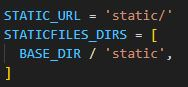
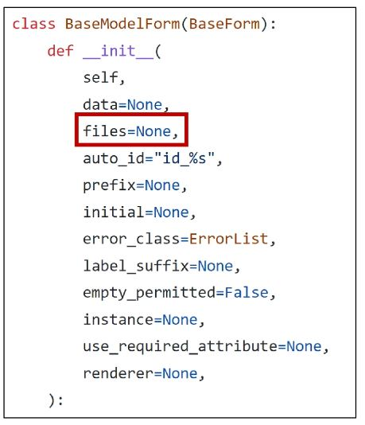

# Django : Static files

## Static files
- 정적 파일
- 서버 측에서 변경되지 않고 고정적으로 제공되는 파일 (이미지, JS, CSS)

### 웹 서버와 정적 파일
- 웹 서버의 기본동작은 '특정 위치 (URL)에 있는 자원'을 요청(HTTP request) 받아서 응답(HTTP response)을 처리하고 제공(serving)하는 것

- 이는 "자원에 접근 가능한 주소가 있다." 라는 의미
- 웹 서버는 요청 받은 URL로 서버에 존재하는 정적 자원을 제공함
- -> "정적 파일을 제공하기 위한 경로(URL)" 가  있어야함

### Static files 제공하기
1. 기본 경로에서 제공하기 : app 안에 static 파일을 만들 때 사용
2. 추가 경로에서 제공하기 : app 안이 아니라 app 밖에 statci 파일을 만들 때 사용
  
### Static files 기본 경로
- app폴더/static/

### 기본 경로 static file 제공하기
- artciles/static/articles/ 경로에 이미지 파일 배치

- static file은 물리적인 주소로 불러올 수 없다

- static tag는 built in tag가 아니기 때문에 import 하는 것 처럼 load를 해줘야한다

- img 파일을 제공하는 주소가 존재 한다.
- static 파일은 반드시 약속된 주소를 사용해야한다.

### 기본 경로 static file 제공하기
- static tag 사용해 이미지 파일에 대한 url 제공
  

### 기본 경로 static file 제공하기
- static_url 확인

### STATIC_URL
- 기본 경로 및 추가 경로에 위치한 정적 파일을 참조하기 위한 URL 실제 파일이나 디렉토리가 아니며, URL로만 존재

### URL + STATIC_URL + 정적파일 경로
- http://127.0.0.1:8000/static/articles/sample-1.png

### Static files 추가 경로
- STATICFILES_DIRS에 문자열 값으로 추가 경로 설정
  

- base directory 바로 밑에 있는 static 경로도 추가 경로로 설정하겠다

### 추가 경로 static file 제공하기
- 추가 경로에 이미지 파일 배치

- static tag를 사용해 이미지 파일에 대한 url 제공

- 이미지 출력 및 경로 확인

### 정적 파일을 제공하려면 요청에 응답하기 위한 URL이 필요

## Media files

- 사용자가 웹에 업로드 하는 정적 파일 (user-uploaded)
- 큰 범주 안에서는 static file
- static file은 개발자가 올리는 이미지 css js 파일 등
- media file은 서비스를 사용하는 유저가 올리는 파일들

## 이미지 업로드

### ImageField()
- 이미지 업로드에 사용하는 '모델' 필드
- 이미지 객체가 직접 저장되는 것이 아닌 '이미지 파일의 경로' 가 문자열로 DB에 저장

### 미디어 파일을 제공하기 전 사전 준비
1. settings.py에 MEDIA_ROOT, MEDIA_URL 설정
2. 작성한 MEDIA_ROOT와 MEDIA_URL에 대한 url 지정

### MEDIA_ROOT
- 미디어 파일들이 위치하는 디렉토리의 절대 경로
- 실제 물리적으로 이미지가 올라가는 위치

### MEDIA_URL
- MEDIA_ROOT에서 제공되는 미디어 파일에 대한 주소를 새엇ㅇ
- (STATIC_URL과 동일한 역할)

### MEDIA_ROOT와 MEDIA_URL에 대한 url 지정
- project urls.py에서 작성
- 업로드 된 파일의 ULR == settings.MEDIA_URL
- 위 URL을 통해 참조하는 파일의 실제 위치 == settings.MEDIA_ROOT

https://docs.djangoproject.com/en/4.2/howto/static-files/

### 이미지 업로드
- blank=True 속성을 작성해 빈 문자열이 저장될 수 있도록 제약 조건 설정
- blank=False(기본값)일 경우 게시글 쓸 때마다 이미지를 반드시 넣어야 하는 상황 발생
  

- 기존 필드 사이에 작성해도 실제 테이블 생성 시에는 가장 우측(뒤)에 추가됨

- ImageField를 사용하려면 반드시 Pillow 라이브러리가 필요 (파이썬 상에서 이미지를 처리하기 위한 라이브러리)
- https://pypi.org/project/Pillow/

- migration 진행
- field type은 문자열

- form 태그는 기본적으로 텍스트 데이터만 전달할 수 있다
- create.html에 form 요소의 enctype 속성 추가
  

- views 함수에서 파일들은 POST로 보내지지 않고 FILES로 보내진다

- 이미지 경로가 문자열로 들어가게 된다 (경로는 우리가 설정한 절대경로)
- 파일은 어떠한 특정 경로가 올라가 있고 데이터베이스에는 경로 주소가 올라가 있다
- 문자열로 저장되는 이유는
  1. 성능 및 DB 최적화
    - 직접 파일을 저장하면 DB크기가 급격하게 증가 -> 성능 저하
    - 파일 자체는 파일 시스템에 별도로 저장
    - DB에는 극 파일에 대한 문자열 경로만 저장하도록 한다

  2. 유지 보수 관점
    - 만약 DB에 직접 파일을 저장 해버리면 만약 이미지 파일을 변경하거나 업데이트 할 때 DB를 직접 조작해야함
    - 그런데 DB에 경로만 저장되어 있다면 파일시스템에서만 파일을 수정하면 됨

  3. 실제 웹 서비스 제공 시
    - 외부 클라우드 서비스에 파일들을 저장하기 때문에 그 경로를 받아와야함

## 업로드 이미지 제공

### 업로드 이미지 제공하기
- 'url' 속성을 통해 업로드 파일의 경로 값을 얻을 수 있음
- article.image.url
- 업로드 파일의 경로
- article.image
- 업로드 파일의 이름

- 이미지를 업로드하지 않은 게시물은 detail 템플릿을 렌더링 할 수 없음
- 이미지 데이터가 있는 경우만 이미지를 출력할 수 있도록 처리

### 업로드 이미지 수정
- 수정 페이지 form 요소에 enctype 속성 추가

- update view 함수에서 업로드 파일에 대한 추가 코드 작성

## 참고

### 'upload_to' argument
- ImageField()의 upload_to 인자를 사용해 미디어 파일을 추가 경로 설정

- ROOT 경로는 변하지 않는다

- 똑같은 이름의 파일을 다른 사용자가 업로드 하더라도 framework 자체적으로 난수 값을 추가로 이름을 넣어준다

- 작성되는 순간의 연월일에 따른 새로운 폴더를 만들 수 있다

- 각 유저별로 폴더를 생성할 수도 있다

### request.FILES가 두번째 위치 인자인 이유
- ModelForm 상위 클래스 BaseModelForm의 생성자 함수 키워드 인자

